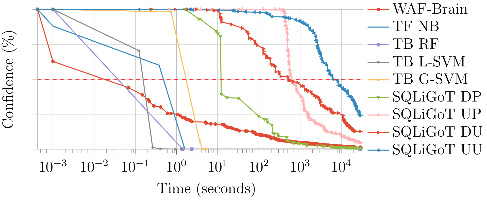

# WAF-A-MoLE

A *guided mutation-based fuzzer* for ML-based Web Application Firewalls, inspired by AFL and based on the [FuzzingBook](https://www.fuzzingbook.org) by Andreas Zeller et al.

Given an input SQL injection query, it tries to produce a *semantic invariant* query that is able to bypass the target WAF.
You can use this tool for assessing the robustness of your product by letting WAF-A-MoLE explore the solution space to find dangerous "blind spots" left uncovered by the target classifier.


[](https://www.python.org/downloads/release/python-374/)
[](https://github.com/AvalZ/WAF-A-MoLE/blob/master/LICENSE)
[](https://waf-a-mole.readthedocs.io/en/latest/?badge=latest)

# Architecture


WAF-A-MoLE takes an initial payload and inserts it in the payload **Pool**, which manages a priority queue ordered by the WAF confidence score over each payload.

During each iteration, the head of the payload Pool is passed to the **Fuzzer**, where it gets randomly mutated, by applying one of the available mutation operators.


## Mutation operators

Mutations operators are all *semantics-preserving* and they leverage the high expressive power of the SQL language (in this version, MySQL).

Below are the mutation operators available in the current version of WAF-A-MoLE.

| Mutation | Example |
| --- | --- |
|  Case Swapping | `admin' OR 1=1#` ⇒ `admin' oR 1=1#` |
| Whitespace Substitution | `admin' OR 1=1#` ⇒ `admin'\t\rOR\n1=1#`|
| Comment Injection | `admin' OR 1=1#` ⇒ `admin'/**/OR 1=1#`|
| Comment Rewriting | `admin'/**/OR 1=1#` ⇒ `admin'/*xyz*/OR 1=1#abc`|
| Integer Encoding | `admin' OR 1=1#` ⇒ `admin' OR 0x1=(SELECT 1)#`|
| Operator Swapping | `admin' OR 1=1#` ⇒ `admin' OR 1 LIKE 1#`|
| Logical Invariant | `admin' OR 1=1#` ⇒ `admin' OR 1=1 AND 0<1#`|
| Number Shuffling | `admin' OR 1=1#` ⇒ `admin' OR 2=2#`|

# How to cite us

WAF-A-MoLE implements the methodology presented in ["WAF-A-MoLE: Evading Web Application Firewalls through Adversarial Machine Learning"](https://dl.acm.org/doi/abs/10.1145/3341105.3373962).
A pre-print of our article can also be found on [arXiv](https://arxiv.org/abs/2001.01952).

If you want to cite us, please use the following (BibTeX) reference:
```
@inproceedings{demetrio20wafamole,
  title={WAF-A-MoLE: evading web application firewalls through adversarial machine learning},
  author={Demetrio, Luca and Valenza, Andrea and Costa, Gabriele and Lagorio, Giovanni},
  booktitle={Proceedings of the 35th Annual ACM Symposium on Applied Computing},
  pages={1745--1752},
  year={2020}
}
```

# Running WAF-A-MoLE

## Prerequisites

* [numpy](https://numpy.org/)
* [keras](https://keras.io/)
* [scikit-learn](https://scikit-learn.org/stable/)
* [joblib](https://github.com/joblib/joblib)
* [sqlparse](https://github.com/andialbrecht/sqlparse)
* [networkx](https://networkx.github.io/)
* [Click](https://click.palletsprojects.com/en/7.x/)

## Setup

`pip install -r requirements.txt`

## Sample Usage

You can evaluate the robustness of your own WAF, or try WAF-A-MoLE against some example classifiers.
In the first case, have a look at the [Model](https://github.com/AvalZ/waf-a-mole/blob/master/wafamole/models/model.py) class. Your custom model needs to implement this class in order to be evaluated by WAF-A-MoLE.
We already provide wrappers for *sci-kit learn* and *keras* classifiers that can be extend to fit your feature extraction phase (if any).

### Help

`wafamole --help`
```
Usage: wafamole [OPTIONS] COMMAND [ARGS]...

Options:
  --help  Show this message and exit.

Commands:
  evade  Launch WAF-A-MoLE against a target classifier.
```


`wafamole evade --help`
```
Usage: wafamole evade [OPTIONS] MODEL_PATH PAYLOAD

  Launch WAF-A-MoLE against a target classifier.

Options:
  -T, --model-type TEXT     Type of classifier to load
  -t, --timeout INTEGER     Timeout when evading the model
  -r, --max-rounds INTEGER  Maximum number of fuzzing rounds
  -s, --round-size INTEGER  Fuzzing step size for each round (parallel fuzzing
                            steps)
  --threshold FLOAT         Classification threshold of the target WAF [0.5]
  --random-engine TEXT      Use random transformations instead of evolution
                            engine. Set the number of trials
  --output-path TEXT        Location were to save the results of the random
                            engine. NOT USED WITH REGULAR EVOLUTION ENGINE
  --help                    Show this message and exit.

```

### Evading example models

We provide some pre-trained models you can have fun with, located in [wafamole/models/custom/example_models](https://github.com/AvalZ/waf-a-mole/tree/master/wafamole/models/custom/example_models).
The classifiers we used are listed in the table below.

| Classifier name| Algorithm
| --- | --- |
| [WafBrain](https://github.com/BBVA/waf-brain) | Recurrent Neural Network |
| [ML-Based-WAF](https://github.com/vladan-stojnic/ML-based-WAF) | Non-Linear SVM |
| [ML-Based-WAF](https://github.com/vladan-stojnic/ML-based-WAF) | Stochastic Gradient Descent |
| [ML-Based-WAF](https://github.com/vladan-stojnic/ML-based-WAF) | AdaBoost |
| Token-based | Naive Bayes |
| Token-based | Random Forest |
| Token-based | Linear SVM |
| Token-based | Gaussian SVM |
| [SQLiGoT](https://www.sciencedirect.com/science/article/pii/S0167404816300451) - Directed Proportional | Gaussian SVM |
| [SQLiGoT](https://www.sciencedirect.com/science/article/pii/S0167404816300451) - Directed Unproportional | Gaussian SVM |
| [SQLiGoT](https://www.sciencedirect.com/science/article/pii/S0167404816300451) - Undirected Proportional | Gaussian SVM |
| [SQLiGoT](https://www.sciencedirect.com/science/article/pii/S0167404816300451) - Undirected Unproportional | Gaussian SVM |

#### WAF-BRAIN - Recurrent Neural Newtork

Bypass the pre-trained WAF-Brain classifier using a `admin' OR 1=1#` equivalent.

```bash
wafamole evade --model-type waf-brain wafamole/models/custom/example_models/waf-brain.h5  "admin' OR 1=1#"
```

#### ML-Based-WAF - Non-Linear SVM (with original WAF-A-MoLE dataset)
Bypass the pre-trained ML-Based-WAF SVM classifier using a `admin' OR 1=1#` equivalent. 

```bash
wafamole evade --model-type mlbasedwaf wafamole/models/custom/example_models/mlbasedwaf_svc.dump  "admin' OR 1=1#"
```

#### ML-Based-WAF - Non-Linear SVM (with SQLiV5/SQLiV3 datasets)
Bypass the pre-trained ML-Based-WAF SVM classifier using a `admin' OR 1=1#` equivalent. Note that SQLiV5 is a dataset sourced from [Kaggle](https://www.kaggle.com/datasets/syedsaqlainhussain/sql-injection-dataset) expanded with a series of queries generated by WAF-A-MoLE itself, as a proof of concept that WAF-A-MoLE queries can enhance the robustness of a WAF with retraining. Use `mlbasedwaf_svc_sqliv3.dump` to bypass the WAF trained with the original Kaggle dataset (SQLiV3).

```bash
wafamole evade --model-type mlbasedwaf wafamole/models/custom/example_models/mlbasedwaf_svc_sqliv5.dump  "admin' OR 1=1#"
```

#### ML-Based-WAF - Stochastic Gradient Descent (SGD)
Bypass the pre-trained ML-Based-WAF SGD classifier using a `admin' OR 1=1#` equivalent. 

```bash
wafamole evade --model-type mlbasedwaf wafamole/models/custom/example_models/mlbasedwaf_sgd.dump  "admin' OR 1=1#"
```

#### ML-Based-WAF - AdaBoost
Bypass the pre-trained ML-Based-WAF AdaBoost classifier using a `admin' OR 1=1#` equivalent (takes longer than other models, at around 2 to 5 minutes of runtime). 

```bash
wafamole evade --model-type mlbasedwaf wafamole/models/custom/example_models/mlbasedwaf_ada.dump  "admin' OR 1=1#"
```
#### Token-based - Naive Bayes

Bypass the pre-trained token-based Naive Bayes classifier using a `admin' OR 1=1#` equivalent.

```bash
wafamole evade --model-type token wafamole/models/custom/example_models/naive_bayes_trained.dump  "admin' OR 1=1#"
```

#### Token-based - Random Forest

Bypass the pre-trained token-based Random Forest classifier using a `admin' OR 1=1#` equivalent.

```bash
wafamole evade --model-type token wafamole/models/custom/example_models/random_forest_trained.dump  "admin' OR 1=1#"
```

#### Token-based - Linear SVM

Bypass the pre-trained token-based Linear SVM classifier using a `admin' OR 1=1#` equivalent.

```bash
wafamole evade --model-type token wafamole/models/custom/example_models/lin_svm_trained.dump  "admin' OR 1=1#"
```

#### Token-based - Gaussian SVM

Bypass the pre-trained token-based Gaussian SVM classifier using a `admin' OR 1=1#` equivalent.

```bash
wafamole evade --model-type token wafamole/models/custom/example_models/gauss_svm_trained.dump  "admin' OR 1=1#"
```

#### SQLiGoT

Bypass the pre-trained SQLiGOT classifier using a `admin' OR 1=1#` equivalent.
Use **DP**, **UP**, **DU**, or **UU** for (respectivly) Directed Proportional, Undirected Proportional, Directed Unproportional and Undirected Unproportional.

```bash
wafamole evade --model-type DP wafamole/models/custom/example_models/graph_directed_proportional_sqligot "admin' OR 1=1#"
```

**BEFORE LAUNCHING EVALUATION ON SQLiGoT**

These classifiers are more robust than the others, as the feature extraction phase produces vectors with a more complex structure, and all pre-trained classifiers have been strongly regularized.
It may take hours for some variants to produce a payload that achieves evasion (see Benchmark section).

**Note on newer ML-Based-WAF models**

Some models based on a slightly modified version of vladan-stojnic's [ML-Based-WAF](https://github.com/vladan-stojnic/ML-based-WAF) have been recently added, from an extension of WAF-A-MoLE entitled [wafamole++](https://github.com/nidnogg/wafamole-plusplus) by [nidnogg](https://github.com/nidnogg). Testing the AdaBoost model might take a longer time than usual (usually 2 to 5 minutes).

There are variants trained with the [SQLiV5.json](https://github.com/nidnogg/sqliv5-dataset) dataset, while most use the original SQL injection from WAF-A-MoLE dataset by default. 

A Google Colaboratory [notebook](https://colab.research.google.com/drive/1YPHb8lrbxN6RjJWjwvM1upvsVoV7de8r?usp=sharing) is provided with the training routines for some of these models, using the original WAF-A-MoLE dataset (modified to the SQLiV5 format). Any dataset can be used as long as they're in the same format as SQLiV5.json.

### Custom adapters

First, create a custom Model class that implements the `extract_features` and `classify` methods.

```python
class YourCustomModel(Model):
    def extract_features(self, value: str):
    	# TODO: extract features
        feature_vector = your_custom_feature_function(value)
        return feature_vector

    def classify(self, value):
    	# TODO: compute confidence
        confidence = your_confidence_eval(value)
        return confidence
```

Then, create an object from the model and instantiate an `engine` object that uses your model class.

```python
model = YourCustomModel() #your init
engine = EvasionEngine(model)
result = engine.evaluate(payload, max_rounds, round_size, timeout, threshold)
```

# Benchmark

We evaluated WAF-A-MoLE against all our example models.

The plot below shows the time it took for WAF-A-MoLE to mutate the `admin' OR 1=1#` payload until it was accepted by each classifier as benign.

On the *x* axis we have time (in seconds, logarithmic scale).
On the *y* axis we have the *confidence* value, i.e., how sure a classifier is that a given payload is a SQL injection (in percentage).

Notice that being "50% sure" that a payload is a SQL injection is equivalent to flipping a coin.
This is the usual classification threshold: if the confidence is lower, the payload is classified as benign.



Experiments were performed on [DigitalOcean *Standard* Droplets](https://www.digitalocean.com/products/droplets/).

# Contribute

Questions, bug reports and pull requests are welcome.

In particular, if you are interested in expanding this project, we look for the following contributions:

1. New WAF adapters
1. New mutation operators
1. New search algorithms

# Team

* [Luca Demetrio](http://csec.it/people/luca_demetrio/) - [CSecLab](https://csec.it/), DIBRIS, University of Genova
* [Andrea Valenza](https://avalz.it/) - [CSecLab](https://csec.it/), DIBRIS, University of Genova
* [Gabriele Costa](https://www.imtlucca.it/it/gabriele.costa) - [SysMA](http://sysma.imtlucca.it/), IMT Lucca
* [Giovanni Lagorio](https://csec.it/people/giovanni_lagorio/) - [CSecLab](https://csec.it/), DIBRIS, University of Genova
