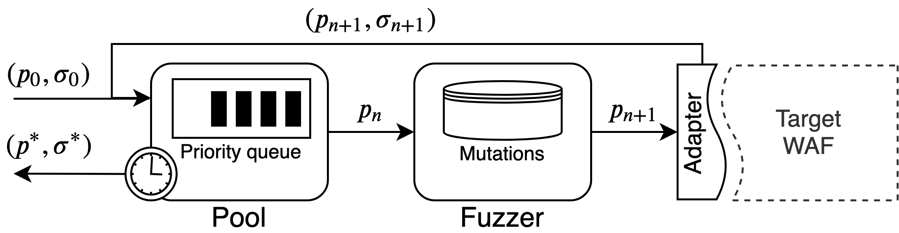

# WAF-A-MoLE

A *guided mutation-based fuzzer* for ML-based Web Application Firewalls, inspired by AFL and based on the excellent [FuzzingBook](https://www.fuzzingbook.org) from Andreas Zeller et al.

[](https://www.python.org/downloads/release/python-374/)
[](https://github.com/AvalZ/WAF-A-MoLE/blob/master/LICENSE)

# Architecture



WAF-A-MoLE takes an initial payload and inserts it in the payload **Pool**, which manages a priority queue ordered on the WAF confidence score over each payload.

During each iteration, the head of the payload Pool is passed to the **Fuzzer** and it is randomly mutated, applying one of the available mutation operators.


## Mutation operators

Mutations operators are all *semantics preserving* and they leverage the flexibility of the SQL language (in this version, MySQL).

These are the mutation operators available in the current version of WAF-A-MoLE.

| Mutation | Example | 
| --- | --- |
|  Case Swapping | `admin' OR 1=1#` ⇒ `admin' oR 1=1#` |
| Whitespace Substitution | `admin' OR 1=1#` ⇒ `admin'\t\rOR\n1=1#`| 
| Comment Injection | `admin' OR 1=1#` ⇒ `admin'/**/OR 1=1#`|
| Comment Rewriting | `admin'/**/OR 1=1#` ⇒ `admin'/*xyz*/OR 1=1#abc`|
| Integer Encoding | `admin' OR 1=1#` ⇒ `admin' OR 0x1=(SELECT 1)#`| 
| Operator Swapping | `admin' OR 1=1#` ⇒ `admin' OR 1 LIKE 1#`| 
| Logical Invariant | `admin' OR 1=1#` ⇒ `admin' OR 1=1 AND 0<1#`| 


# Running WAF-A-MoLE

## Prerequisites

* numpy
* keras
* scikit-learn
* joblib
* sqlparse
* networkx
* [Click](https://click.palletsprojects.com/en/7.x/)

## Setup

`pip install -r requirements.txt`

## Sample Usage

You can bypass your own WAF, or try WAF-A-MoLE against some example classifiers.

### Help

`wafamole --help` 


### Evading example models

These models are located in [wafamole/models/custom/example_models](https://github.com/AvalZ/waf-a-mole/tree/master/wafamole/models/custom/example_models).

Available example models

| Classifier |
| [WafBrain](https://github.com/BBVA/waf-brain) - Recurrent Neural Network | 
| Token-based - Naive Bayes | 
| Token-based - Random Forest | 
| Token-based - Linear SVM | 
| Token-based - Gaussian SVM | 
| [SQLiGoT](https://www.sciencedirect.com/science/article/pii/S0167404816300451) - Directed Proportional |  
| [SQLiGoT](https://www.sciencedirect.com/science/article/pii/S0167404816300451) - Directed Unproportional |  
| [SQLiGoT](https://www.sciencedirect.com/science/article/pii/S0167404816300451) - Undirected Proportional |  
| [SQLiGoT](https://www.sciencedirect.com/science/article/pii/S0167404816300451) - Undirected Unproportional |  


#### Token-based - Linear SVM

Bypass a token-based Linear SVM classifier using a `admin' OR 1=1#` equivalent.

```bash
wafamole evade --model-type token wafamole/models/custom/example_models/lin_svm_trained.dump  "admin' OR 1=1#"
```

#### SQLiGoT


```bash
wafamole evade --model-type DP wafamole/models/custom/example_models/graph_directed_proportional_sqligot "admin' OR 1=1#"
```

BE CAREFUL! This classifier is really strong, it may take a long time (up to 3 hours) for some variants (see Benchmark section).

# Benchmark

# Contribute

