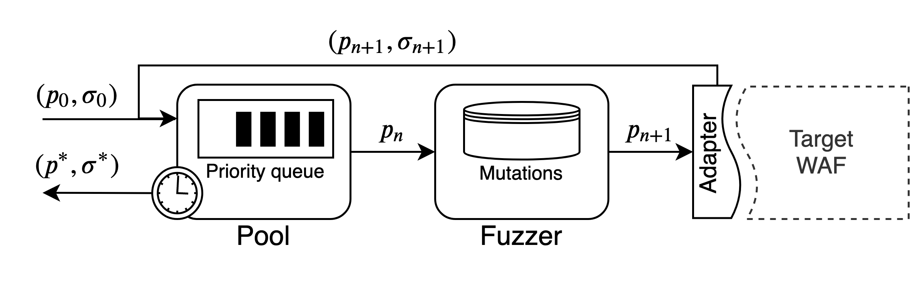

WAF-A-MoLE
==========

A *guided mutation-based fuzzer* for ML-based Web Application Firewalls,
inspired by AFL and based on the
`FuzzingBook <https://www.fuzzingbook.org>`__ by Andreas Zeller et al.

Given an input SQL injection query, it tries to produce a *semantic
invariant* query that is able to bypass the target WAF. You can use this
tool for assessing the robustness of your product by letting WAF-A-MoLE
explore the solution space to find dangerous “blind spots” left
uncovered by the target classifier.

|Python Version| |License| |Documentation Status|

Architecture
============

   WAF-A-MoLE Architecture

WAF-A-MoLE takes an initial payload and inserts it in the payload
**Pool**, which manages a priority queue ordered by the WAF confidence
score over each payload.

During each iteration, the head of the payload Pool is passed to the
**Fuzzer**, where it gets randomly mutated, by applying one of the
available mutation operators.

Mutation operators
------------------

Mutations operators are all *semantics-preserving* and they leverage the
high expressive power of the SQL language (in this version, MySQL).

Below are the mutation operators available in the current version of
WAF-A-MoLE.

======================= ===================================================
Mutation                Example
======================= ===================================================
Case Swapping           ``admin' OR 1=1#`` ⇒ ``admin' oR 1=1#``
Whitespace Substitution ``admin' OR 1=1#`` ⇒ ``admin'\t\rOR\n1=1#``
Comment Injection       ``admin' OR 1=1#`` ⇒ ``admin'/**/OR 1=1#``
Comment Rewriting       ``admin'/**/OR 1=1#`` ⇒ ``admin'/*xyz*/OR 1=1#abc``
Integer Encoding        ``admin' OR 1=1#`` ⇒ ``admin' OR 0x1=(SELECT 1)#``
Operator Swapping       ``admin' OR 1=1#`` ⇒ ``admin' OR 1 LIKE 1#``
Logical Invariant       ``admin' OR 1=1#`` ⇒ ``admin' OR 1=1 AND 0<1#``
======================= ===================================================

Components
----------

.. toctree::
   :maxdepth: 10
   :caption: Contents:

   source/modules

Running WAF-A-MoLE
==================

Prerequisites
-------------

-  `numpy <https://numpy.org/>`__
-  `keras <https://keras.io/>`__
-  `scikit-learn <https://scikit-learn.org/stable/>`__
-  `joblib <https://github.com/joblib/joblib>`__
-  `sqlparse <https://github.com/andialbrecht/sqlparse>`__
-  `networkx <https://networkx.github.io/>`__
-  `Click <https://click.palletsprojects.com/en/7.x/>`__

Setup
-----

``pip install -r requirements.txt``

Sample Usage
------------

You can evaluate the robustness of your own WAF, or try WAF-A-MoLE
against some example classifiers. In the first case, have a look at the
`Model <https://github.com/AvalZ/waf-a-mole/blob/master/wafamole/models/model.py>`__
class. Your custom model needs to implement this class in order to be
evaluated by WAF-A-MoLE. We already provide wrappers for *sci-kit learn*
and *keras* classifiers that can be extend to fit your feature
extraction phase (if any).

Help
~~~~

``wafamole --help``

::

   Usage: wafamole [OPTIONS] COMMAND [ARGS]...

   Options:
     --help  Show this message and exit.

   Commands:
     evade  Launch WAF-A-MoLE against a target classifier.

``wafamole evade --help``

::

   Usage: wafamole evade [OPTIONS] MODEL_PATH PAYLOAD

     Launch WAF-A-MoLE against a target classifier.

   Options:
     -T, --model-type TEXT     Type of classifier to load
     -t, --timeout INTEGER     Timeout when evading the model
     -r, --max-rounds INTEGER  Maximum number of fuzzing rounds
     -s, --round-size INTEGER  Fuzzing step size for each round (parallel fuzzing
                               steps)
     --threshold FLOAT         Classification threshold of the target WAF [0.5]
     --random-engine TEXT      Use random transformations instead of evolution
                               engine. Set the number of trials
     --output-path TEXT        Location were to save the results of the random
                               engine. NOT USED WITH REGULAR EVOLUTION ENGINE
     --help                    Show this message and exit.

Evading example models
~~~~~~~~~~~~~~~~~~~~~~

We provide some pre-trained models you can have fun with, located in
`wafamole/models/custom/example_models <https://github.com/AvalZ/waf-a-mole/tree/master/wafamole/models/custom/example_models>`__.
The classifiers we used are listed in the table below.

============================================================================================================= ========================
Classifier name                                                                                               Algorithm
============================================================================================================= ========================
`WafBrain <https://github.com/BBVA/waf-brain>`__                                                              Recurrent Neural Network
Token-based                                                                                                   Naive Bayes
Token-based                                                                                                   Random Forest
Token-based                                                                                                   Linear SVM
Token-based                                                                                                   Gaussian SVM
`SQLiGoT <https://www.sciencedirect.com/science/article/pii/S0167404816300451>`__ - Directed Proportional     Gaussian SVM
`SQLiGoT <https://www.sciencedirect.com/science/article/pii/S0167404816300451>`__ - Directed Unproportional   Gaussian SVM
`SQLiGoT <https://www.sciencedirect.com/science/article/pii/S0167404816300451>`__ - Undirected Proportional   Gaussian SVM
`SQLiGoT <https://www.sciencedirect.com/science/article/pii/S0167404816300451>`__ - Undirected Unproportional Gaussian SVM
============================================================================================================= ========================

WAF-BRAIN - Recurrent Neural Newtork
^^^^^^^^^^^^^^^^^^^^^^^^^^^^^^^^^^^^

Bypass the pre-trained WAF-Brain classifier using a ``admin' OR 1=1#``
equivalent.

.. code:: bash

   wafamole evade --model-type waf-brain wafamole/models/custom/example_models/waf-brain.h5  "admin' OR 1=1#"

Token-based - Naive Bayes
^^^^^^^^^^^^^^^^^^^^^^^^^

Bypass the pre-trained token-based Naive Bayes classifier using a
``admin' OR 1=1#`` equivalent.

.. code:: bash

   wafamole evade --model-type token wafamole/models/custom/example_models/nb_trained.dump  "admin' OR 1=1#"

Token-based - Random Forest
^^^^^^^^^^^^^^^^^^^^^^^^^^^

Bypass the pre-trained token-based Random Forest classifier using a
``admin' OR 1=1#`` equivalent.

.. code:: bash

   wafamole evade --model-type token wafamole/models/custom/example_models/rf_trained.dump  "admin' OR 1=1#"

Token-based - Linear SVM
^^^^^^^^^^^^^^^^^^^^^^^^

Bypass the pre-trained token-based Linear SVM classifier using a
``admin' OR 1=1#`` equivalent.

.. code:: bash

   wafamole evade --model-type token wafamole/models/custom/example_models/lin_svm_trained.dump  "admin' OR 1=1#"

Token-based - Gaussian SVM
^^^^^^^^^^^^^^^^^^^^^^^^^^

Bypass the pre-trained token-based Gaussian SVM classifier using a
``admin' OR 1=1#`` equivalent.

.. code:: bash

   wafamole evade --model-type token wafamole/models/custom/example_models/gauss_svm_trained.dump  "admin' OR 1=1#"

SQLiGoT
^^^^^^^

Bypass the pre-trained SQLiGOT classifier using a ``admin' OR 1=1#``
equivalent. Use **DP**, **UP**, **DU**, or **UU** for (respectivly)
Directed Proportional, Undirected Proportional, Directed Unproportional
and Undirected Unproportional.

.. code:: bash

   wafamole evade --model-type DP wafamole/models/custom/example_models/graph_directed_proportional_sqligot "admin' OR 1=1#"

**BEFORE LAUNCHING EVALUATION ON SQLiGoT**

These classifiers are more robust than the others, as the feature
extraction phase produces vectors with a more complex structure, and all
pre-trained classifiers have been strongly regularized. It may take
hours for some variants to produce a payload that achieves evasion (see
Benchmark section).

Benchmark
=========

We evaluated WAF-A-MoLE against all our example models.

The plot below shows the time it took for WAF-A-MoLE to mutate the
``admin' OR 1=1#`` payload until it was accepted by each classifier as
benign.

On the *x* axis we have time (in seconds, logarithmic scale). On the *y*
axis we have the *confidence* value, i.e., how sure a classifier is that
a given payload is a SQL injection (in percentage).

Notice that being “50% sure” that a payload is a SQL injection is
equivalent to flipping a coin. This is the usual classification
threshold: if the confidence is lower, the payload is classified as
benign.

.. figure:: docs/fig/benchmark_over_time.png
   :alt: Benchmark over time

   Benchmark over time

Experiments were performed on `DigitalOcean Standard
Droplets <https://www.digitalocean.com/products/droplets/>`__.

Contribute
==========

Questions, bug reports and pull requests are welcome.

In particular, if you are interested in expanding this project, we look
for the following contributions:

1. New WAF adapters
2. New mutation operators
3. New search algorithms

Team
====

-  `Luca Demetrio <http://csec.it/people/luca_demetrio/>`__ -
   `CSecLab <https://csec.it/>`__, DIBRIS, University of Genova
-  `Andrea Valenza <https://avalz.it/>`__ -
   `CSecLab <https://csec.it/>`__, DIBRIS, University of Genova
-  `Gabriele Costa <https://www.imtlucca.it/it/gabriele.costa>`__ -
   `SysMA <http://sysma.imtlucca.it/>`__, IMT Lucca
-  `Giovanni Lagorio <https://csec.it/people/giovanni_lagorio/>`__ -
   `CSecLab <https://csec.it/>`__, DIBRIS, University of Genova

.. |Python Version| image:: https://img.shields.io/badge/Python-3.7-green.svg
   :target: https://www.python.org/downloads/release/python-374/
.. |License| image:: https://img.shields.io/badge/license-MIT-blue.svg
   :target: https://github.com/AvalZ/WAF-A-MoLE/blob/master/LICENSE
.. |Documentation Status| image:: https://readthedocs.org/projects/waf-a-mole/badge/?version=latest
   :target: https://waf-a-mole.readthedocs.io/en/latest/?badge=latest
